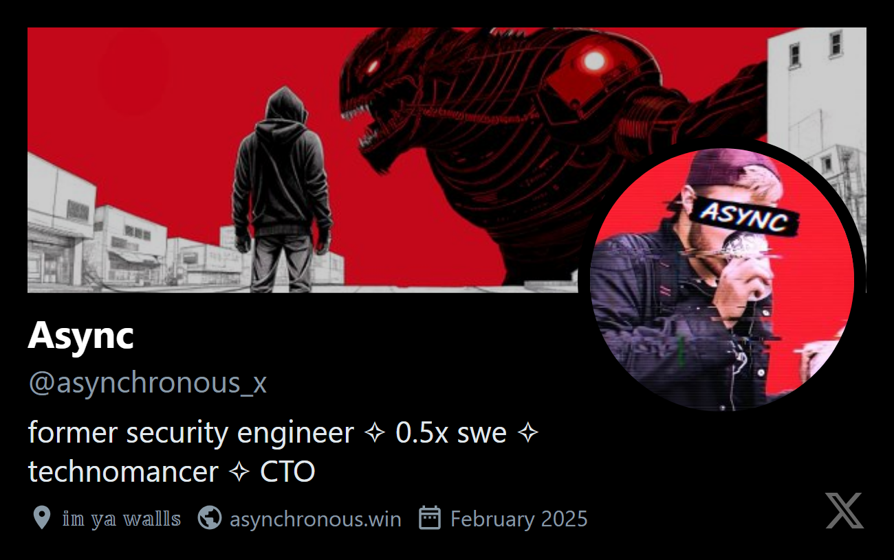
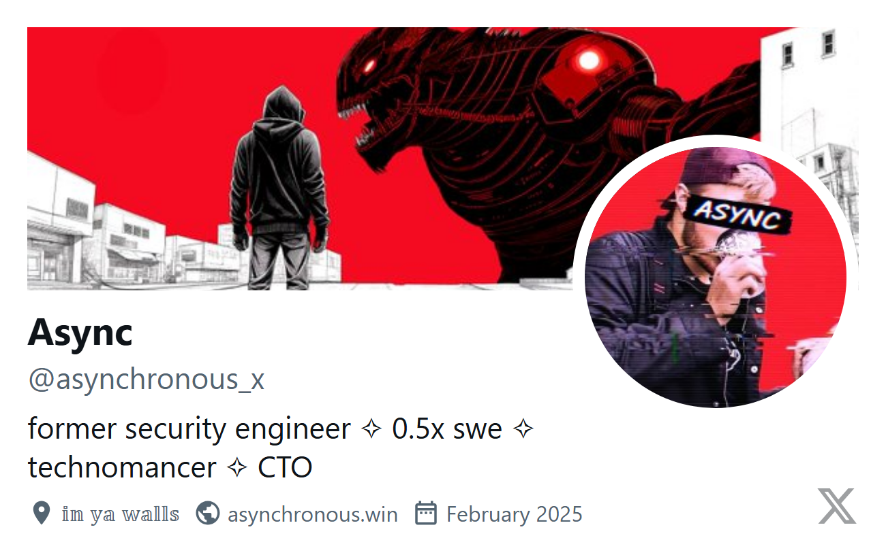

# X Business Card Generator

Turn your X profile into a business card because apparently that's what we're doing now.

## What's This?

A tool that scrapes X profiles and generates sleek business cards. Perfect for when you need to look professional but your entire personality is just tweets.

## Examples

Because seeing is believing:




## Quick Start

```bash
# Install dependencies (one-time suffering)
npm install
npx playwright install chromium

# Stalk a single person
npm start elonmusk        # dark mode (for edgelords)
npm start elonmusk light  # light mode (for normies)

# Mass surveillance
echo -e "elonmusk\nsundarpichai\nsatyanadella" > targets.txt
npm start targets.txt light
```

## Output

Cards get yeeted into the `outputs/` folder as `username_business_card_theme.png`

## Features

- Scrapes profile pics, headers, bios, and all that jazz
- Standard business card size (86mm x 54mm)
- Dark/light themes for all your mood swings
- Batch processing for when you're feeling extra

## Requirements

- Node.js 18+ (this ain't your grandma's JavaScript)
- Internet (duh)
- Public X profile(s)

## Legal Stuff

This tool respects robots.txt about as much as X respects your timeline algorithm. Use responsibly or whatever.

## Troubleshooting

**It's not working!**
- Check if the profile exists and is public
- Make sure you didn't typo the username (it happens)
- Try turning it off and on again

**Still not working?**
- X probably changed their layout again
- Open an issue and complain

---

*Made with 🖤 and Claude Code*